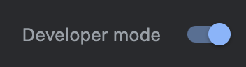

<h1> GITINDER Chrome Extension</h1>

## Swipe To Approve PRs!

## Getting Started

- Clone the Repo
- Run `npm i`
- Build the app: `npm run build`

- Open Google Chrome
- Type [chrome://extensions](chrome://extensions) in the url
- Search for the developer mode toggle and turn it on
  
- click on load unpacked button:
  
- File Dialog should open:

  - Look for the `dist` folder that has been created in the project folder and select it

- Look for the extension button in you Google Chrome Browser and click on it:
  
- There should be the Gitinder icon. click on the pin button to pin it to the top:
  
- Now go to some pull request in github and try to click on the extension icon 😊

### If You Would like to add code to the project

> you can run `npm run dev` and use the extension with `--watch` mode (hot relaod etc...)

# Enjoy!
